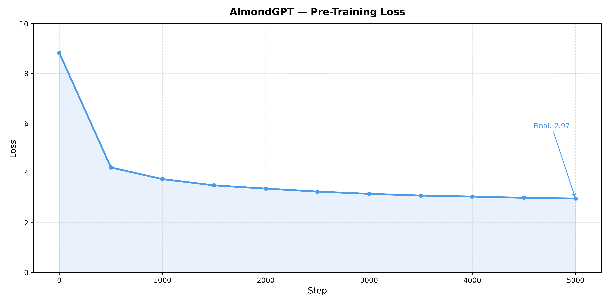
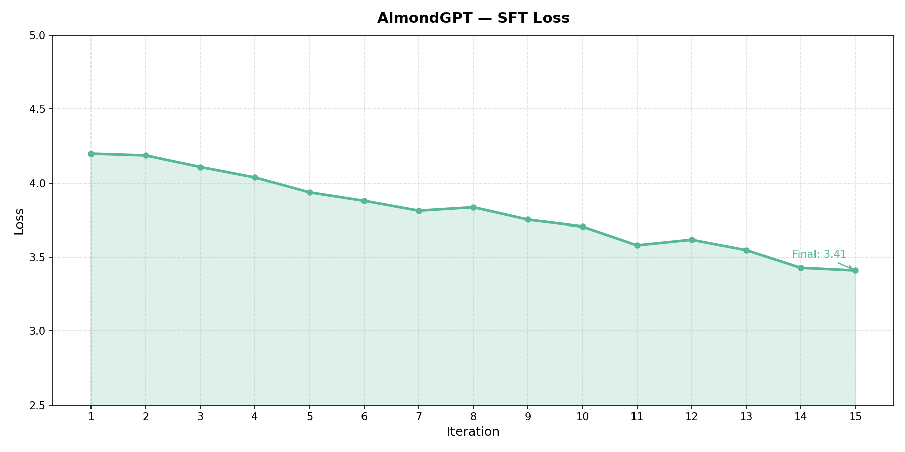

# AlmondGPT — End-to-End LLM Alignment from Scratch

> *Small like an almond. Built to understand, not to impress.*

AlmondGPT is a small language model built entirely from scratch — tokenizer, architecture, and full alignment pipeline — to deeply understand every component of modern LLM development.

**This is not a fine-tuned version of an existing model.** Every component is implemented manually: BPE tokenizer, transformer architecture with modern design choices, supervised fine-tuning, and Direct Preference Optimization.

---

## Pipeline Overview

```
Raw Text (TinyStories)
        ↓
BPE Tokenizer (from scratch)
        ↓
Pre-Training — AlmondGPT Base
        ↓
Supervised Fine-Tuning (SFT)
        ↓
Direct Preference Optimization (DPO)
        ↓
AlmondGPT — Aligned
```

---

## Architecture

AlmondGPT uses modern LLaMA-style architecture choices, not vanilla GPT-2:

| Component | Choice | Why |
|-----------|--------|-----|
| Normalization | RMSNorm | Simpler and faster than LayerNorm |
| Positional Encoding | RoPE | Better length generalization |
| Attention | Grouped Query Attention (GQA) | Memory efficient, faster inference |
| Feed Forward | SwiGLU | Empirically better than ReLU/GELU |
| KV Cache | - | Efficient autoregressive inference |

**Model size:** ~10-15M parameters  
**Vocab size:** 5,848 (BPE early-stopped at low-frequency threshold)  
**Context length:** 128 tokens  

---

## Training Summary

### Pre-Training
- **Dataset:** TinyStories (50,000 rows)
- **Optimizer:** AdamW with Cosine Annealing LR
- **Loss:** Cross Entropy (next-token prediction)
- **Final Loss:** ~2.97



### Supervised Fine-Tuning (SFT)
- **Dataset:** Custom instruction-response pairs
- **Format:** `<|user|> ... <|assistant|> ... <|endoftext|>`
- **Final Loss:** ~3.41



### Direct Preference Optimization (DPO)
- **Dataset:** Custom chosen/rejected preference pairs
- **Epochs:** 5
- **Final Train Loss:** 0.2812 | **Final Val Loss:** 0.1201


---

## Output Comparison

> Prompt: *"Tell me a story about a blue hat."*

| Stage | Output |
|-------|--------|
| **Base** | *"Once upon a time there was a blue hat and it was very pretty and shiny..."* |
| **SFT** | *"Tom had a red hat and a blue hat and a red hat with a red hat in his blue hat in his finger..."* |
| **DPO** | *"A blue hat felt like a bunny. The bugs decided to share the white animals together..."* |

---

## Limitations

This project is a **proof-of-concept pipeline**, not a production chatbot. Known limitations:

- **Small scale** — 10-15M parameters vs 7B+ for capable chatbots. Output quality is limited.
- **Small dataset** — 50k rows of TinyStories. Model vocabulary and world knowledge are narrow.
- **Hallucination** — model frequently generates incoherent tokens (e.g. `pmiddm`, `thumbant`). Expected at this scale.
- **SFT/DPO dataset size** — preference dataset is small (~50-100 pairs). Alignment signal is present but subtle.
- **No evaluation benchmark** — model is not evaluated on standard benchmarks (HellaSwag, MMLU, etc.)

**What this project proves:** the full alignment pipeline works end-to-end. Every component — tokenizer, base model, SFT, DPO — is implemented and functional.

---

## Project Structure

```
end-to-end-llm-alignment/
├── basemodel/          # Pre-training pipeline
│   ├── src/
│   │   ├── model/      # GPT, Block, Attention, FFN, Normalization
│   │   ├── tokenizer/  # BPE tokenizer from scratch
│   │   └── data/       # Data loading and processing
│   └── config.yaml
├── sftmodel/           # Supervised Fine-Tuning pipeline
│   ├── src/
│   │   ├── data/       # Instruction dataset, collate, loader
│   │   └── finetuning/ # SFT training loop
│   └── config.yaml
├── alignment/          # DPO Alignment pipeline
│   ├── src/
│   │   └── dpo/        # DPO dataset, training loop
│   └── config.yaml
├── utils/              # Shared utilities
├── docs/               # Documentation and assets
└── plot_losses.py      # Generate loss curve plots
```

---

## Setup

```bash
git clone https://github.com/adinfarel/end-to-end-llm-alignment.git
cd end-to-end-llm-alignment
pip install -e .
pip install torch datasets pyyaml tqdm matplotlib streamlit
```

### Run Full Pipeline
```bash
python basemodel/src/pipeline/main.py
```

### Run Inference
```bash
python basemodel/src/tests/generate.py
```

---

## What I Learned

Building this taught me things that reading papers alone never would:

- **BPE tokenizer** early-stops when token frequency drops below threshold — actual vocab size diverges from target vocab size, requiring dynamic config updates
- **KV Cache** needs careful invalidation between generate calls to avoid duplicate output artifacts
- **DPO** requires a frozen reference model alongside the policy model — memory doubles during alignment training
- **Loss alone is not enough** — qualitative output comparison reveals alignment signal that numbers don't show

---

*Built by Adinfarel — AI Engineering track*  
*"The goal was never to build something impressive. The goal was to understand."*
