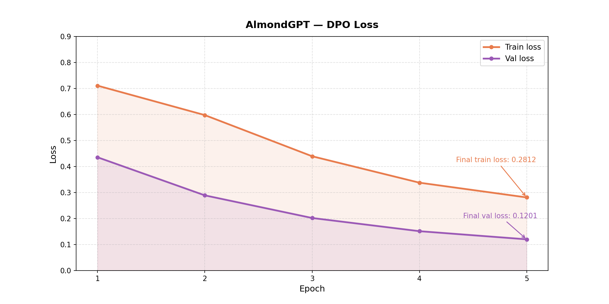

# Direct Preference Optimization (DPO)

> *SFT taught the model how to talk. DPO teaches it how to talk the way I like.*

---

## Why Do We Need Alignment?

After SFT, the model can follow instruction format. But "able to answer" doesn't mean "answering in the way we prefer."

Imagine two answers to the same prompt:

```
Prompt: "Tell me a story about a brave dog."

Answer A: "Max was a brave dog who saved his owner from danger.
            He ran fast and barked loud until help arrived. The end."

Answer B: "Dog. Brave. Story. The dog went to the store and bought milk."
```

An SFT model might generate both with probabilities that aren't very different. Alignment teaches the model that A is better than B.

---

## Why Not Classic RLHF?

Before understanding DPO, I had to understand why RLHF exists and why it's complicated.

**RLHF pipeline:**

```
1. Train a Reward Model (RM) from chosen/rejected data
2. Use RM to score policy model outputs
3. Update policy with PPO to maximize RM score
4. Add KL constraint so policy doesn't drift too far from reference
```

**The problem: it requires 4 models simultaneously.**

```
π_model   → the policy being trained
π_ref     → reference model (frozen SFT model)
RM        → reward model (trained from chosen/rejected)
Critic    → value function for PPO
```

Memory and compute are expensive. But there's a more fundamental problem:

**Sampling has no gradient.**

When a policy model generates output (greedy, beam search, top-p, top-k), the sampling process is **not differentiable**. We can't directly backprop from reward to policy weights.

RLHF solves this with REINFORCE / PPO — estimating gradients via sampling. But this is unstable and requires heavy hyperparameter tuning.

---

## DPO — An Elegant Simplification

DPO (Direct Preference Optimization) eliminates the reward model and the sampling gradient problem entirely.

**Key insight:** it turns out the optimal policy from the RLHF objective can be written in closed form. We don't need to train a separate reward model — the reward model is implicitly contained in the ratio between the policy and reference model.

**DPO loss:**

```
L_DPO = -log σ(β * (log π(chosen)/π_ref(chosen) - log π(rejected)/π_ref(rejected)))
```

Breaking it down:

```
log π(chosen)/π_ref(chosen)    = log-ratio for chosen
log π(rejected)/π_ref(rejected) = log-ratio for rejected

DPO: maximize (chosen log-ratio - rejected log-ratio)
```

**My intuition:**

We want the chosen log-ratio to be **larger** than the rejected log-ratio. This means: the policy model should assign higher probability to the chosen response relative to the reference model, compared to the rejected response.

β is a temperature hyperparameter controlling how tightly we hold the reference model. Higher β → policy is not allowed to drift far from reference.

---

## Why the Negative Sign in the Loss?

PyTorch's optimizer does gradient descent — it minimizes loss. But we want to **maximize** the chosen vs rejected log-ratio.

```python
loss = -log(sigmoid(beta * (chosen_ratio - rejected_ratio)))
```

The negative sign converts a maximization problem into a minimization problem. Gradient descent on `-reward` = gradient ascent on `reward`.

---

## KL Divergence in DPO

The log-ratio `log π(x)/π_ref(x)` is the **KL Divergence term**.

```
KL(π || π_ref) = E[log π(x)/π_ref(x)]
```

KL Divergence measures how different two distributions are — like Euclidean distance but for probability distributions. The key difference is that KL is not symmetric:

```
KL(P || Q) ≠ KL(Q || P)
```

In DPO, the KL constraint ensures the policy doesn't deviate too far from the reference model. Without it, the model could **reward hack** — assigning very high probability to chosen responses while collapsing its entire distribution.

---

## Dataset Format

```json
{
  "prompt": "Tell me a story about a brave dog.",
  "chosen": "Max was a brave dog who saved his owner...",
  "rejected": "Dog. Brave. Story. The dog went to the store..."
}
```

For every sample, we need:
- The same prompt
- A chosen response (what we prefer)
- A rejected response (what we prefer less)

---

## Implementation — Two Models Simultaneously

DPO requires two models: the **policy model** (being trained) and the **reference model** (frozen).

```python
# Reference model: load SFT weights, freeze all parameters
ref_model = AlmondGPTModel(config_path)
ref_model.load_state_dict(sft_checkpoint['model'])
for param in ref_model.parameters():
    param.requires_grad = False

# Policy model: load SFT weights, will be trained
pi_model = AlmondGPTModel(config_path)
pi_model.load_state_dict(sft_checkpoint['model'])
```

**Memory implication:** DPO requires 2x the memory of SFT. This needs to be accounted for from the start — if the base model is too large, DPO will OOM.

---

## Training Config

```yaml
num_epochs    : 5
learning_rate : 1e-5  (even smaller than SFT)
beta          : 0.1   (KL constraint strength)
optimizer     : AdamW
```

---

## Loss Curve



| Epoch | Train Loss | Val Loss |
|-------|-----------|----------|
| 1 | 0.7109 | 0.4355 |
| 2 | 0.5977 | 0.2891 |
| 3 | 0.4395 | 0.2021 |
| 4 | 0.3379 | 0.1514 |
| 5 | 0.2812 | 0.1201 |

Loss decreases consistently and validation loss stays below train loss throughout — a good sign, no significant overfitting. The model successfully learned preference signal from a small dataset.

---

## Output Comparison

> Prompt: *"Write a story about Lily the princess."*

**SFT model:**
```
A girl loved to run around the castle with her dog,
making a dragon between goat who lived next bit.
```

**DPO model:**
```
Lily and her family found a lovely princess in the park. One morning,
Lily's mom told her to be careful not to hurt her up.
Lily learned that her parents say sorry and not take things that don't belong to her.
```

The difference is subtle but measurable from the loss curve: the model successfully shifted its output distribution toward chosen responses.

---

## The Whole Pipeline — Final Intuition

If I had to explain the entire alignment pipeline in one paragraph:

Pre-training teaches the model language — finding the minimum loss point in a vast parameter space. SFT teaches format and when to respond — narrowing the distribution toward something more instructable. DPO teaches preference — from all possible grammatically correct outputs, which ones we actually want.

```
Pre-training : "can talk"
SFT          : "can talk in the right format"
DPO          : "talks the way I prefer"
```

Gradient descent in pre-training and SFT: minimize loss, find the minimum. DPO uses a negative sign to convert preference maximization into a minimization problem — because PyTorch only does gradient descent, not ascent.

---

## Limitations

- Preference dataset is very small (~50 pairs) — alignment signal is present but weak
- Small model (10-15M params) limits how far alignment can go
- No formal evaluation metrics — only qualitative comparison

**What was successfully proven:** the DPO pipeline works end-to-end. Loss decreases consistently, validation loss doesn't diverge, and output distribution shifts toward chosen responses.

---

## What I Learned

DPO is simpler than it looks. What makes it hard to understand isn't the implementation — it's **why it works** mathematically. Why we can eliminate the reward model, why the log-ratio is equivalent to KL divergence, why the negative sign converts ascent into descent.

Once I understood all of that, the implementation was surprisingly straightforward.

This is also where I first truly understood that **sampling has no gradient** — and why classic RLHF needs REINFORCE as a workaround. DPO is elegant precisely because it bypasses that problem entirely.
